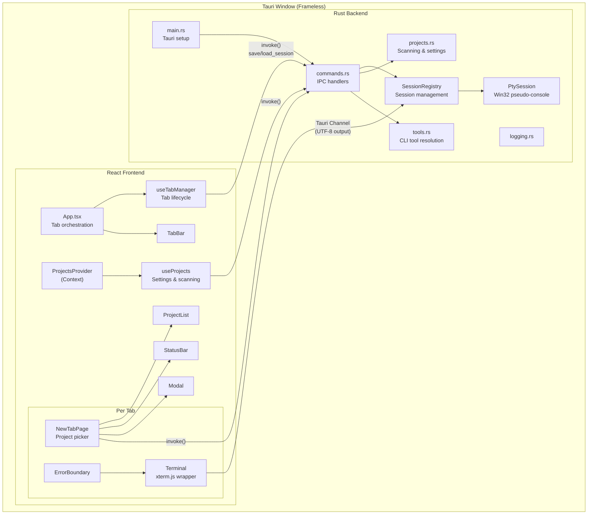
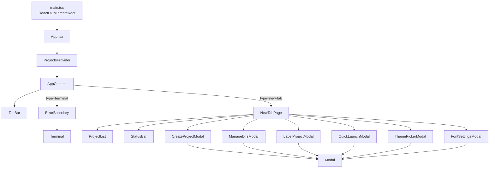

# Anvil -- Technical Documentation

**Version:** 1.0.0
**Platform:** Windows only
**Last verified:** 2026-03-14

---

## Table of Contents

1. [Project Overview](#1-project-overview)
2. [Getting Started](#2-getting-started)
3. [Architecture Overview](#3-architecture-overview)
4. [Rust Backend](#4-rust-backend)
5. [React Frontend](#5-react-frontend)
6. [IPC Protocol](#6-ipc-protocol)
7. [Keyboard Shortcuts](#7-keyboard-shortcuts)
8. [Configuration](#8-configuration)
9. [Architecture Notes](#9-architecture-notes)
10. [Development Guide](#10-development-guide)

---

## 1. Project Overview

Anvil is a Windows-only Tauri 2 desktop application for selecting and launching CLI tool sessions (Claude Code, Gemini) in tabbed terminals. Users select a project from a scanned directory list, choose a tool, model, and settings, then launch an interactive CLI session in an embedded terminal.

### Tech Stack

| Layer | Technology | Version |
|-------|-----------|---------|
| Frontend framework | React | 19.x |
| Language | TypeScript | 5.7+ |
| Bundler | Vite | 6.x |
| Terminal emulator | xterm.js (with WebGL addon) | 5.5.0 |
| Backend runtime | Rust (edition 2021) | -- |
| Desktop framework | Tauri | 2.x |
| Win32 PTY | `windows` crate | 0.62 |
| Process management | `win32job` crate | 2.x |

**Source:** `app/package.json`, `app/src-tauri/Cargo.toml`

### Key Capabilities

- Tabbed terminal interface with up to 10 concurrent PTY sessions (`session.rs:16`)
- Project directory scanning with git branch/dirty status detection (`projects.rs:218-255`)
- 2 CLI tools (Claude Code, Gemini), 5 Claude models, 3 effort levels (`tools.rs:3-11`, `types.ts:47-58`)
- 10 dark themes (8 standard + 2 retro) with live switching (`types.ts:84-177`)
- Session restore across app restarts (`useTabManager.ts:48-70`)
- File drag-and-drop into terminal (`Terminal.tsx:200-215`)
- Configurable font family and size (`types.ts:23-34`)
- Custom frameless window with resize handles (`App.tsx:102-110`)

---

## 2. Getting Started

### Prerequisites

- **Windows 11** (or Windows 10 with pseudo-console support)
- **Node.js** (for frontend build)
- **Rust toolchain** (for Tauri backend)
- **Claude Code CLI** installed globally (`npm install -g @anthropic-ai/claude-code`) -- resolved via `which` crate or fallback at `~/.local/bin/claude.exe` (`tools.rs:13-26`)
- **Gemini CLI** (optional, `npm install -g @google/gemini-cli`) -- resolved via `which` crate (`tools.rs`)

### Development

```bash
# Install frontend dependencies
cd app
npm install

# Run in development mode (starts Vite dev server + Tauri)
cargo tauri dev

# Build release binary
cargo tauri build
```

**Source:** `app/src-tauri/tauri.conf.json:6-11`

- Dev server URL: `http://localhost:1420`
- Frontend dist output: `app/dist/`
- `beforeDevCommand`: `npm run dev`
- `beforeBuildCommand`: `npm run build` (runs `tsc && vite build`)

### Window Configuration

The app launches a single frameless window:

| Property | Value |
|----------|-------|
| Label | `main` |
| Title | `Anvil` |
| Default size | 1200 x 800 |
| Minimum size | 800 x 500 |
| Decorations | `false` (custom title bar) |
| CSP | `default-src 'self'; style-src 'self' 'unsafe-inline'` |

**Source:** `app/src-tauri/tauri.conf.json:14-28`

---

## 3. Architecture Overview

### System Diagram



### Data Flow

1. **App startup:** `main.rs` creates a `SessionRegistry` (with Win32 Job Object), starts the session reaper thread, then launches the Tauri application.
2. **Frontend mount:** React renders `App` inside `ProjectsProvider`. `useProjects` loads settings and usage data from disk via IPC, then scans project directories. `useTabManager` restores saved sessions from `load_session`.
3. **Project selection:** User picks a project in `NewTabPage`, which calls `onLaunch` to convert the tab from `new-tab` to `terminal` type.
4. **Terminal spawn:** `Terminal` component mounts, creates an xterm.js instance, calls `spawnTool()` which opens a Tauri `Channel` and invokes `spawn_tool` IPC. The backend spawns a Win32 pseudo-console process.
5. **I/O loop:** PTY output is read in a background thread, sent as UTF-8 text through the Channel. User input flows back via `write_pty` IPC.
6. **Heartbeat:** A 5-second interval heartbeat keeps the session alive; the reaper kills sessions with no heartbeat for 60 seconds.
7. **Cleanup:** On tab close, `killSession()` terminates the process. On window close, `kill_all()` terminates all sessions.

---

## 4. Rust Backend

### Module Overview

| Module | File | Purpose |
|--------|------|---------|
| `main` | `main.rs` | App entry point, Tauri setup, window close handler |
| `commands` | `commands.rs` | All Tauri IPC command handlers |
| `pty` | `pty.rs` | Win32 pseudo-console creation and I/O |
| `session` | `session.rs` | Session registry, output batching, reaper |
| `projects` | `projects.rs` | Project scanning, settings/usage persistence |
| `tools` | `tools.rs` | CLI tool resolution and command building (Claude, Gemini) |
| `logging` | `logging.rs` | File + stderr logging with macros |
| `watcher` | `watcher.rs` | Filesystem watcher for project directory changes |
| `marketplace` | `marketplace.rs` | Anvil marketplace sync |

### main.rs

**Source:** `app/src-tauri/src/main.rs`

Entry point. Hides the console window in release builds via `#![cfg_attr(not(debug_assertions), windows_subsystem = "windows")]`. Creates a `SessionRegistry` (wrapped in `Arc`), starts the reaper thread, then builds the Tauri application with all IPC handlers registered. On window close (label `"main"`), calls `registry.kill_all()` to terminate all PTY sessions.

### PTY Lifecycle

**Source:** `app/src-tauri/src/pty.rs`, `app/src-tauri/src/session.rs`

#### PtySession (`pty.rs`)

A `PtySession` wraps a Win32 pseudo-console with these handles:

| Field | Type | Purpose |
|-------|------|---------|
| `hpc` | `HPCON` | Pseudo-console handle |
| `process_handle` | `HANDLE` | Child process handle |
| `thread_handle` | `HANDLE` | Child primary thread handle |
| `input_write` | `Mutex<HANDLE>` | Write end of input pipe, mutex-guarded for per-session write serialization |
| `output_read` | `HANDLE` | Read end of output pipe (PTY -> frontend) |
| `pid` | `u32` | Child process ID |
| `_attr_list_buf` | `Vec<u8>` | Owned proc thread attribute list buffer |

**Spawn flow** (`PtySession::spawn`, `pty.rs:57-200`):

1. Create two anonymous pipes (input and output).
2. Call `CreatePseudoConsole` with the input read handle and output write handle.
3. Close the pipe ends now owned by the pseudo-console.
4. Clean up all handles on any error path (pipes, HPCON, attribute list).
5. Initialize a proc thread attribute list with `PROC_THREAD_ATTRIBUTE_PSEUDOCONSOLE`.
6. Build a Unicode environment block (inheriting current env, then overwriting with custom vars).
7. Call `CreateProcessW` with the command line, working directory, and environment.
8. Return `PtySession` holding all handles.

**SAFETY (unsafe Send+Sync):** `input_write` is protected by a Mutex, `output_read` is only used by the dedicated reader thread, and `process_handle`/`thread_handle` are only used for thread-safe Win32 wait/terminate calls.

**I/O methods:**

| Method | Signature | Description |
|--------|-----------|-------------|
| `write` | `(&self, data: &[u8]) -> io::Result<()>` | Acquires per-session mutex, writes to PTY input pipe in a loop until all data is sent |
| `read` | `(&self, buf: &mut [u8]) -> io::Result<usize>` | Reads from the PTY output pipe (blocking) |
| `resize` | `(&self, cols: i16, rows: i16) -> io::Result<()>` | Calls `ResizePseudoConsole` |
| `wait_for_exit` | `(&self) -> io::Result<i32>` | Blocks until process exits, returns exit code |
| `kill` | `(&self)` | Calls `TerminateProcess`, then `ClosePseudoConsole` to break the output pipe and unblock the reader thread |

**Drop:** Cleans up in order: `DeleteProcThreadAttributeList`, `ClosePseudoConsole`, locks input_write mutex to close handle, then closes remaining handles (`pty.rs:260-279`).

#### SessionRegistry (`session.rs`)

Manages a `HashMap<String, SessionEntry>` protected by a `Mutex`. Each entry holds an `Arc<PtySession>` and a `last_heartbeat` timestamp.

**Constants** (`session.rs:15-17`):

| Constant | Value | Purpose |
|----------|-------|---------|
| `MAX_SESSIONS` | 10 | Maximum concurrent sessions |
| `OUTPUT_BATCH_MS` | 16 | Output batching interval (~60fps) |
| `MAX_WRITE_SIZE` | 65536 | Maximum single write size (64 KB) |
| `HEARTBEAT_TIMEOUT_SECS` | 60 | Heartbeat timeout (12x safety margin over 5s heartbeat interval) |

**PtyEvent enum** (`session.rs:19-24`):

```rust
pub enum PtyEvent {
    Output { data: String },  // UTF-8 text (lossy-converted)
    Exit { code: i32 },
}
```

Serialized with `serde(rename_all = "camelCase", tag = "type")`.

**spawn()** (`session.rs:54-133`):

1. Checks session count against `MAX_SESSIONS`.
2. Creates `PtySession` via `PtySession::spawn()`.
3. Generates a UUID session ID.
4. Spawns an **output reader thread** that reads 16384-byte chunks, accumulates into a buffer (capacity 32768), and flushes as UTF-8 text `PtyEvent::Output` when: (a) 16ms batch timer expires, (b) accumulator reaches capacity, or (c) a partial read indicates the process is idle. Maintains a `utf8_remainder` buffer (up to 3 bytes) to reassemble multi-byte UTF-8 sequences split across reads. Before flushing, prepends remainder from previous flush; after flushing, checks for incomplete trailing sequence via `incomplete_utf8_tail()` and saves it. Output is sent as UTF-8 text (lossy-converted), not base64.
5. Spawns an **exit watcher thread** that calls `wait_for_exit()` and sends `PtyEvent::Exit`.
6. Inserts the session entry and returns the session ID.

**`incomplete_utf8_tail()`**: Examines trailing bytes to detect incomplete multi-byte UTF-8 sequences at buffer boundaries. Returns the count of bytes to hold back (0-3).

**Win32 Job Object** (`session.rs:37-47`): On creation, the registry creates a Win32 Job Object with `limit_kill_on_job_close` and assigns the current process. This ensures all child processes are killed if the launcher crashes.

**Reaper thread** (`session.rs:185-220`): Runs every 10 seconds, uses a **two-phase reaper pattern**: Phase 1: collect stale session IDs and their `Arc<PtySession>` under the lock. Phase 2: drop the lock, then kill outside. This avoids holding the registry mutex during blocking Win32 calls. Sessions whose `last_heartbeat` is older than 60 seconds are considered stale. Includes standby detection: resets all heartbeats if elapsed time since last check exceeds 30 seconds.

**`kill()`**: Removes entry from HashMap, then calls `pty.kill()` outside the lock. When `kill()` calls `ClosePseudoConsole`, it breaks the output pipe. The reader thread's `ReadFile` returns an error, which exits the loop and drops the `Arc<PtySession>`.

**`kill_all()`**: Drains all sessions under the lock, then kills each outside the lock.

**`write()` and `resize()`**: Clones `Arc<PtySession>` under the global lock, drops the lock, then performs I/O outside the critical section.

### Project Scanning

**Source:** `app/src-tauri/src/projects.rs`

#### scan_projects (`projects.rs:257-311`)

1. Iterates each parent directory in `project_dirs`.
2. Lists immediate subdirectories, skipping hidden directories (names starting with `.`).
3. Processes directories in chunks of 8 threads.
4. For each directory, calls `scan_one_project()`.

#### scan_one_project (`projects.rs:218-255`)

For each directory:
1. Reads the directory name as the project name.
2. Checks for `CLAUDE.md` file existence.
3. Runs `git status --branch --porcelain=v2` to extract branch name and dirty status.
4. Returns a `ProjectInfo` struct.

**ProjectInfo** (`projects.rs:79-88`):

```rust
pub struct ProjectInfo {
    pub path: String,
    pub name: String,
    pub label: Option<String>,
    pub branch: Option<String>,
    pub is_dirty: bool,
    pub has_claude_md: bool,
}
```

Serialized with `serde(rename_all = "camelCase")`.

#### create_project (`projects.rs:325-355`)

Validates the project name (no path separators, no `..`, no ANSI escape sequences). Creates the directory with `create_dir_all`. Optionally runs `git init`.

### Settings and Persistence

**Source:** `app/src-tauri/src/projects.rs:13-68, 90-216`

All data files are stored in `dirs::data_local_dir() / "anvil"` (typically `%LOCALAPPDATA%\anvil`).

| File | Path | Purpose |
|------|------|---------|
| Settings | `anvil-settings.json` | User preferences |
| Settings backup | `anvil-settings.json.bak` | Previous settings |
| Usage data | `anvil-usage.json` | Project usage tracking |
| Session data | `anvil-session.json` | Tab restore state |
| Log file | `anvil.log` | Application log |

#### Settings struct (`projects.rs:13-37`)

| Field | Type | Default |
|-------|------|---------|
| `version` | `u32` | `1` |
| `tool_idx` | `usize` | `0` |
| `model_idx` | `usize` | `0` |
| `effort_idx` | `usize` | `0` |
| `sort_idx` | `usize` | `0` |
| `theme_idx` | `usize` | `0` |
| `font_family` | `String` | `"Cascadia Code"` |
| `font_size` | `u32` | `14` |
| `skip_perms` | `bool` | `false` |
| `security_gate` | `bool` | `false` |
| `project_dirs` | `Vec<String>` | `["D:\\Projects"]` or `CLAUDE_LAUNCHER_PROJECTS_DIR` env var |
| `single_project_dirs` | `Vec<String>` | `[]` |
| `project_labels` | `HashMap<String, String>` | `{}` |
| `extra` | `HashMap<String, Value>` | `{}` (serde flatten, forward-compatible) |

**Save strategy:** Atomic write via temp file + rename. Before overwriting, the current file is backed up to `.bak`. Load falls back to backup if primary is corrupt.

#### UsageData (`projects.rs:71-77`)

```rust
pub type UsageData = HashMap<String, UsageEntry>;

pub struct UsageEntry {
    pub last_used: f64,   // Unix timestamp (seconds)
    pub count: u64,       // Total launch count
}
```

`record_usage()` is serialized with a static `Mutex` to prevent TOCTOU races.

#### Session persistence (`projects.rs:119-138`)

Session data is an opaque `serde_json::Value` with a 1 MB size cap. Written atomically via temp file + rename.

### CLI Tool Integration

**Source:** `app/src-tauri/src/tools.rs`

#### Tools

| Index | Name | Package |
|-------|------|---------|
| 0 | Claude Code | `@anthropic-ai/claude-code` |
| 1 | Gemini CLI | `@google/gemini-cli` |

#### Models (`tools.rs:3-9`, Claude only)

| Index | Display | Model ID |
|-------|---------|----------|
| 0 | `sonnet` | `claude-sonnet-4-6` |
| 1 | `opus` | `claude-opus-4-6` |
| 2 | `haiku` | `claude-haiku-4-5` |
| 3 | `sonnet [1M]` | `claude-sonnet-4-6[1m]` |
| 4 | `opus [1M]` | `claude-opus-4-6[1m]` |

#### Effort levels (`tools.rs:11`, Claude only)

| Index | Value |
|-------|-------|
| 0 | `high` |
| 1 | `medium` |
| 2 | `low` |

#### resolve_claude_exe (`tools.rs:13-26`)

1. Try `which::which("claude")` (PATH lookup).
2. Fallback: `~/.local/bin/claude.exe`.
3. Error if not found.

#### build_command (`tools.rs:28-63`)

Builds the command line arguments: `--model <id> --effort <level>`, plus `--dangerously-skip-permissions` if enabled.

If the resolved executable is a `.cmd` or `.bat` shim, wraps it with `cmd.exe /c "<path>"` to handle spaces.

#### claude_env (`tools.rs:65-71`)

Sets three environment variables for the spawned Claude process:

| Variable | Value |
|----------|-------|
| `CLAUDE_CODE_MAX_OUTPUT_TOKENS` | `64000` |
| `TERM` | `xterm-256color` |
| `COLORTERM` | `truecolor` |

#### resolve_gemini_exe (`tools.rs`)

1. Try `which::which("gemini")` (PATH lookup).
2. Error if not found.

#### build_gemini_command (`tools.rs`)

Builds the Gemini CLI command line. If the resolved executable is a `.cmd` or `.bat` shim, wraps it with `cmd.exe /c "<path>"` to handle spaces.

#### gemini_env (`tools.rs`)

Sets environment variables for the spawned Gemini process:

| Variable | Value |
|----------|-------|
| `TERM` | `xterm-256color` |
| `COLORTERM` | `truecolor` |

### Logging

**Source:** `app/src-tauri/src/logging.rs`

- Log file is placed next to the executable (not in a separate data directory).
- Log **rotation** on startup: `.log` -> `.log.1` -> `.log.2` -> `.log.3` (keeps up to 3 rotated files).
- Mid-session rotation when file reaches 10 MB.
- Output goes to both stderr and the log file.
- Timestamp format: `YYYY-MM-DD HH:MM:SS.mmm` (UTC).
- Sanitizes newlines in log messages to prevent log forging.
- Only flushes on ERROR level to reduce syscalls.
- Three macros: `log_info!`, `log_error!`, `log_debug!`.

### ProjectWatcher

**Source:** `app/src-tauri/src/watcher.rs`

Watches project container directories for create/remove/rename events. Uses the `notify` crate with trailing-edge debounce (1 second quiet period). Emits `projects-changed` Tauri event to trigger frontend rescan. Updated when settings change (via the `save_settings` command).

---

## 5. React Frontend

### Component Hierarchy



### Components

#### App (`App.tsx`)

**Source:** `app/src/App.tsx`

Root component. Wraps everything in `ProjectsProvider`. The inner `AppContent` uses `useTabManager` for tab state and renders:

- 8 resize handles for the frameless window (using `appWindow.startResizeDragging`)
- `TabBar` for tab switching
- A `.tab-content` container with one panel per tab

Tabs of type `"new-tab"` render `NewTabPage`; tabs of type `"terminal"` render `Terminal` wrapped in `ErrorBoundary`; tabs of type `"about"` render `AboutPage`.

**Global keyboard shortcuts** (`App.tsx:45-64`):

| Key | Action |
|-----|--------|
| Ctrl+T | Add new tab |
| Ctrl+F4 | Close active tab |
| Ctrl+Tab | Next tab |
| Ctrl+Shift+Tab | Previous tab |

**Window title** updates dynamically: shows the active terminal's project name and count of other terminal tabs (`App.tsx:33-42`).

#### TabBar (`TabBar.tsx`)

**Source:** `app/src/components/TabBar.tsx`

**Props:**

| Prop | Type | Description |
|------|------|-------------|
| `tabs` | `Tab[]` | All tabs |
| `activeTabId` | `string` | Currently active tab ID |
| `onActivate` | `(id: string) => void` | Switch to tab |
| `onClose` | `(id: string) => void` | Close tab |
| `onAdd` | `() => void` | Add new tab |

Uses `data-tauri-drag-region` attribute for window dragging. Tab close has a 150ms animation delay before calling `onClose`. Displays:

- Tab label: project name + model for terminal tabs, "New Tab" for picker tabs
- Output indicator: CSS class `has-output` for background activity
- Exit status: checkmark (code 0) or X mark (nonzero)
- Window controls: minimize, maximize/restore, close (custom SVG buttons)

Wrapped in `React.memo`.

#### Terminal (`Terminal.tsx`)

**Source:** `app/src/components/Terminal.tsx`

**Props:**

| Prop | Type | Description |
|------|------|-------------|
| `tabId` | `string` | Tab identifier |
| `projectPath` | `string` | Absolute path to project |
| `modelIdx` | `number` | Model index |
| `effortIdx` | `number` | Effort level index |
| `skipPerms` | `boolean` | Skip permissions flag |
| `themeIdx` | `number` | Theme index |
| `fontFamily` | `string` | Terminal font family |
| `fontSize` | `number` | Terminal font size |
| `isActive` | `boolean` | Whether this tab is visible |
| `onSessionCreated` | `(tabId, sessionId) => void` | Session ID callback |
| `onNewOutput` | `(tabId) => void` | Background output callback |
| `onExit` | `(tabId, code) => void` | Process exit callback |
| `onError` | `(tabId, msg) => void` | Error callback |
| `onRequestClose` | `(tabId) => void` | Close request callback |

**Lifecycle:**

1. **Mount:** Creates xterm.js instance with WebGL addon (falls back to canvas on error). Attaches `FitAddon` and a `ResizeObserver`.
2. **Spawn:** Deferred to `requestAnimationFrame` so the container has final layout. Calls `spawnTool()` with terminal dimensions.
3. **Input:** `xterm.onData` writes to PTY via `writePty()`. After process exit, any keypress requests tab close.
4. **Output:** Callback writes `Uint8Array` to xterm. If tab is not active, triggers `onNewOutput`.
5. **Heartbeat:** 5-second interval calls `sendHeartbeat()`.
6. **File drop:** Listens for Tauri drag-drop events. Validates paths against `SAFE_WIN_PATH` regex (`/^[a-zA-Z]:\\[\w\s.\-\\()[\]{}@#$%^+=~,]+$/`). Safe paths are written to PTY as space-separated strings.
7. **Unmount:** Cancels animation frame, clears heartbeat, disconnects observer, kills session, disposes xterm.

**Custom key handler** (`Terminal.tsx:105-111`): Intercepts Ctrl+T, Ctrl+F4, and Ctrl+Tab to prevent xterm from consuming them (passes them to global handlers instead).

**Theme/font updates:** Separate `useEffect` hooks update xterm options when `themeIdx`, `fontFamily`, or `fontSize` change, then re-fit the terminal.

Wrapped in `React.memo`. All callbacks stored in refs to avoid stale closures.

#### NewTabPage (`NewTabPage.tsx`)

**Source:** `app/src/components/NewTabPage.tsx`

The project picker screen. Reads shared state from `ProjectsContext`. Manages:

- `selectedIdx` -- currently highlighted project
- `launching` -- prevents double-launch
- `activeModal` -- which modal dialog is open (or null)

**Keyboard handling** (`NewTabPage.tsx:96-218`): Only active when `isActive` is true and no modal is open. Uses refs for all frequently-changing values to keep the handler stable.

**Modals** (all defined in `NewTabPage.tsx`):

| Modal | Trigger | Purpose |
|-------|---------|---------|
| `CreateProjectModal` | F5 | Creates new directory, optional git init |
| `ManageDirsModal` | F7 | Add/remove project scan directories |
| `LabelProjectModal` | F8 | Set custom display label for a project |
| `QuickLaunchModal` | F10 | Launch arbitrary directory path |
| `ThemePickerModal` | F9 | Visual theme grid selector |
| `FontSettingsModal` | F11 | Font family dropdown + size slider (10-24px) |

**Font options** (`NewTabPage.tsx:643-651`): Cascadia Code, Consolas, JetBrains Mono, Fira Code, Source Code Pro, Courier New, Lucida Console.

#### ProjectList (`ProjectList.tsx`)

**Source:** `app/src/components/ProjectList.tsx`

**Props:**

| Prop | Type | Description |
|------|------|-------------|
| `projects` | `ProjectInfo[]` | Filtered/sorted project list |
| `selectedIdx` | `number` | Currently selected index |
| `onSelect` | `(idx: number) => void` | Selection change |
| `onActivate` | `(project: ProjectInfo) => void` | Double-click launch |
| `loading` | `boolean` | Show skeleton loader |
| `launchingIdx` | `number \| undefined` | Index of project being launched |

Displays per project:
- Name (or custom label)
- `MD` badge if `CLAUDE.md` exists
- Git branch name with dirty indicator (`*`)
- Full path

Auto-scrolls selected item into view. Shows skeleton loader (8 animated rows) while loading. Shows empty state with hints for F7/F5 when no projects found.

Wrapped in `React.memo`.

#### StatusBar (`StatusBar.tsx`)

**Source:** `app/src/components/StatusBar.tsx`

Displays current settings and provides clickable buttons for all settings. Split into left section (action buttons: New, Dirs, Label, Quick) and right section (settings: Model, Effort, Sort, Perms, Theme, Font).

**Exported type:** `StatusBarAction = "create-project" | "manage-dirs" | "label-project" | "quick-launch" | "theme-picker" | "font-settings"`

Wrapped in `React.memo`.

#### Modal (`Modal.tsx`)

**Source:** `app/src/components/Modal.tsx`

**Props:**

| Prop | Type | Description |
|------|------|-------------|
| `title` | `string` | Modal title |
| `children` | `ReactNode` | Modal content |
| `onClose` | `() => void` | Close callback |

Closes on Escape (captured in capture phase to intercept before `NewTabPage`) and backdrop click. Uses `role="dialog"`.

#### ErrorBoundary (`ErrorBoundary.tsx`)

**Source:** `app/src/components/ErrorBoundary.tsx`

Class component wrapping `Terminal`. On error, displays the error message and a "Close Tab" button. Logs to console via `componentDidCatch`.

#### Minimap (`Minimap.tsx`)

**Source:** `app/src/components/Minimap.tsx`

**Props:**

| Prop | Type | Description |
|------|------|-------------|
| `xterm` | `Terminal` | xterm.js Terminal instance |
| `isActive` | `boolean` | Whether the parent tab is visible |
| `bookmarksRef` | `RefObject<Set<number>>` | Ref to Set of bookmarked line numbers |

**Features:**
- 2px x 3px character rendering on canvas
- Bookmark indicators for bookmarked lines
- DPI-aware canvas (adjusts for devicePixelRatio)
- Click-to-scroll with bookmark snapping
- Drag scrolling support

**Performance:**
- Cached theme colors, invalidated on theme change via `MutationObserver`
- Separate viewport-only updates from full canvas redraws
- RAF-throttled rendering

#### AboutPage (`AboutPage.tsx`)

**Source:** `app/src/components/AboutPage.tsx`

ASCII logo with module-level grid cache. Displays version and app info.

### Hooks

#### useTabManager (`useTabManager.ts`)

**Source:** `app/src/hooks/useTabManager.ts`

Manages tab lifecycle with `useState`. Initializes with one `new-tab` tab.

**Tab type** (`types.ts:1-12`):

```typescript
interface Tab {
  id: string;                  // crypto.randomUUID()
  type: "new-tab" | "terminal" | "about";
  projectPath?: string;
  projectName?: string;
  toolIdx?: number;
  modelIdx?: number;
  effortIdx?: number;
  skipPerms?: boolean;
  sessionId?: string;
  hasNewOutput?: boolean;
  exitCode?: number | null;
}
```

**Return value:**

| Property | Type | Description |
|----------|------|-------------|
| `tabs` | `Tab[]` | All tabs |
| `activeTab` | `Tab` | Currently active tab object |
| `activeTabId` | `string` | Active tab ID |
| `addTab` | `() => string` | Creates new-tab, returns ID |
| `closeTab` | `(id: string) => void` | Removes tab; destroys window if last tab |
| `updateTab` | `(id: string, updates: Partial<Tab>) => void` | Merges updates into tab |
| `activateTab` | `(id: string) => void` | Switches active tab, clears output indicator |
| `nextTab` | `() => void` | Cycles to next tab (wraps) |
| `prevTab` | `() => void` | Cycles to previous tab (wraps) |
| `markNewOutput` | `(tabId: string) => void` | Marks tab as having new output (guarded -- skips if already set) |

**Session persistence** (`useTabManager.ts:48-102`):

- On mount, calls `load_session` IPC. If valid saved tabs exist, restores them as terminal tabs and appends a fresh new-tab.
- On state change, debounces (500ms) saving terminal tab state via `save_session` IPC. Only persists `projectPath`, `projectName`, `modelIdx`, `effortIdx`, `skipPerms`.
- Uses `useMemo` + `JSON.stringify` to derive saveable state and avoid unnecessary saves.

**Close behavior** (`useTabManager.ts:111-136`): If closing the last tab, calls `getCurrentWindow().destroy()` to close the application.

#### useProjects (`useProjects.ts`)

**Source:** `app/src/hooks/useProjects.ts`

Loads settings, usage data, and projects on mount. Provides filtering, sorting, and settings management.

**Return value:**

| Property | Type | Description |
|----------|------|-------------|
| `settings` | `Settings \| null` | Current settings (null during load) |
| `projects` | `ProjectInfo[]` | Filtered and sorted project list |
| `loading` | `boolean` | Loading state |
| `error` | `string \| null` | Error message |
| `filter` | `string` | Current filter text |
| `setFilter` | `(s: string) => void` | Update filter |
| `updateSettings` | `(updates: Partial<Settings>) => void` | Save settings; rescans if dirs/labels change |
| `refresh` | `() => void` | Rescan projects |
| `recordUsage` | `(path: string) => void` | Record project usage and reload usage data |
| `retry` | `() => void` | Retry after error |

**Sort logic** (`useProjects.ts:86-130`):

| Sort Order | Algorithm |
|------------|-----------|
| `alpha` | `localeCompare` on label or name |
| `last used` | Descending by `last_used` timestamp |
| `most used` | Weighted score: `count * 0.5^((now - last_used) / 30d)` -- exponential decay with 30-day half-life |

**Theme application:** Calls `applyTheme(themeIdx)` whenever `theme_idx` changes (`useProjects.ts:45-48`).

#### usePty (`usePty.ts`)

**Source:** `app/src/hooks/usePty.ts`

Not a React hook -- exports standalone async functions that wrap Tauri IPC calls.

| Function | Signature | IPC Command |
|----------|-----------|-------------|
| `spawnTool` | `(projectPath, toolIdx, modelIdx, effortIdx, skipPerms, cols, rows, onOutput, onExit) => Promise<{sessionId, channel}>` | `spawn_tool` |
| `writePty` | `(sessionId, data) => Promise<void>` | `write_pty` |
| `resizePty` | `(sessionId, cols, rows) => Promise<void>` | `resize_pty` |
| `killSession` | `(sessionId) => Promise<void>` | `kill_session` |
| `sendHeartbeat` | `(sessionId) => Promise<void>` | `heartbeat` |

`spawnTool` creates a Tauri `Channel<PtyEvent>` and writes UTF-8 text output directly to xterm (no base64 decoding needed).

### Context

#### ProjectsContext (`ProjectsContext.tsx`)

**Source:** `app/src/contexts/ProjectsContext.tsx`

Wraps `useProjects()` in a React Context so all `NewTabPage` instances share the same project data, settings, and filter state. The context value is memoized to prevent unnecessary re-renders.

**Provider:** `ProjectsProvider` -- wrap around components that need project data.
**Consumer:** `useProjectsContext()` -- throws if used outside provider.

### Theme System

**Source:** `app/src/types.ts:60-177`, `app/src/themes.ts`

10 built-in dark themes:

| Index | Name |
|-------|------|
| 0 | Catppuccin Mocha (default) |
| 1 | Dracula |
| 2 | One Dark |
| 3 | Nord |
| 4 | Solarized Dark |
| 5 | Gruvbox Dark |
| 6 | Tokyo Night |
| 7 | Monokai |
| 8 | Anvil Forge [retro] |
| 9 | Guybrush [retro] |

Themes 8-9 have a `retro: true` flag which enables retro mode CSS.

Each theme defines 14 color values:

| Color | CSS Variable | Usage |
|-------|-------------|-------|
| `bg` | `--bg` | Main background |
| `surface` | `--surface` | Elevated surfaces |
| `mantle` | `--mantle` | Slightly darker background |
| `crust` | `--crust` | Darkest background |
| `text` | `--text` | Primary text |
| `textDim` | `--text-dim` | Secondary text |
| `overlay0` | `--overlay0` | Subtle borders |
| `overlay1` | `--overlay1` | Stronger borders |
| `accent` | `--accent` | Primary accent (links, focus) |
| `red` | `--red` | Errors, destructive |
| `green` | `--green` | Success |
| `yellow` | `--yellow` | Warnings |
| `cursor` | -- | xterm cursor color |
| `selection` | -- | xterm selection background |

**`applyTheme(themeIdx)`** (`themes.ts:3-20`): Sets CSS custom properties on `document.documentElement`.

**`getXtermTheme(themeIdx)`** (`themes.ts:22-30`): Returns `{ background, foreground, cursor, selectionBackground }` for xterm.js options.

---

## 6. IPC Protocol

Complete list of Tauri IPC commands registered in `main.rs:31-47` with their signatures from `commands.rs`.

### PTY Management

#### `spawn_tool`

Spawns a new CLI tool session in a pseudo-console.

| Parameter | Type | Description |
|-----------|------|-------------|
| `projectPath` | `String` | Absolute path to project directory |
| `toolIdx` | `usize` | Index into TOOLS array (0=claude, 1=gemini) |
| `modelIdx` | `usize` | Index into MODELS array (0-4) |
| `effortIdx` | `usize` | Index into EFFORTS array (0-2) |
| `skipPerms` | `bool` | Pass `--dangerously-skip-permissions` |
| `cols` | `i16` | Terminal columns (1-500) |
| `rows` | `i16` | Terminal rows (1-200) |
| `onEvent` | `Channel<PtyEvent>` | Tauri Channel for output/exit events |

**Returns:** `Result<String, String>` -- session UUID on success.

**Validation:** Rejects UNC paths, non-directory paths, and out-of-range dimensions. Max 10 concurrent sessions.

**Source:** `commands.rs:11-76`

#### `write_pty` (synchronous)

Writes data to a PTY session's input.

| Parameter | Type | Description |
|-----------|------|-------------|
| `sessionId` | `String` | Session UUID |
| `data` | `String` | Data to write (max 64 KB) |

**Returns:** `Result<(), String>`

**Source:** `commands.rs:62-69`

#### `resize_pty` (synchronous)

Resizes a PTY session's terminal dimensions.

| Parameter | Type | Description |
|-----------|------|-------------|
| `sessionId` | `String` | Session UUID |
| `cols` | `i16` | New columns (1-500) |
| `rows` | `i16` | New rows (1-200) |

**Returns:** `Result<(), String>`

**Source:** `commands.rs:71-82`

#### `kill_session` (synchronous)

Terminates a PTY session.

| Parameter | Type | Description |
|-----------|------|-------------|
| `sessionId` | `String` | Session UUID |

**Returns:** `Result<(), String>`

**Source:** `commands.rs:84-91`

#### `heartbeat` (synchronous)

Updates the last heartbeat timestamp for a session (prevents reaper from killing it).

| Parameter | Type | Description |
|-----------|------|-------------|
| `sessionId` | `String` | Session UUID |

**Returns:** `Result<(), String>`

**Source:** `commands.rs:93-99`

#### `active_session_count` (synchronous)

Returns the number of active PTY sessions.

**Parameters:** None

**Returns:** `Result<usize, String>`

**Source:** `commands.rs:101-106`

### Project Management

#### `scan_projects`

Scans configured directories for projects.

| Parameter | Type | Description |
|-----------|------|-------------|
| `projectDirs` | `Vec<String>` | Directories to scan |
| `singleProjectDirs` | `Vec<String>` | Individual project directories (not scanned for subdirs) |
| `labels` | `HashMap<String, String>` | Path-to-label mapping |

**Returns:** `Result<Vec<ProjectInfo>, String>`

Runs on a blocking thread. Scans in parallel (8 threads per chunk).

**Source:** `commands.rs:108-119`

#### `create_project`

Creates a new project directory.

| Parameter | Type | Description |
|-----------|------|-------------|
| `parent` | `String` | Parent directory path |
| `name` | `String` | Project name |
| `gitInit` | `bool` | Run `git init` after creation |

**Returns:** `Result<String, String>` -- full path to created directory.

**Source:** `commands.rs:173-188`

#### `open_in_explorer`

Opens a directory in Windows Explorer.

| Parameter | Type | Description |
|-----------|------|-------------|
| `path` | `String` | Directory path |

**Returns:** `Result<(), String>`

**Source:** `commands.rs:156-171`

### Settings and Usage

#### `load_settings`

Loads settings from disk. Falls back to backup file, then defaults.

**Parameters:** None

**Returns:** `Result<Settings, String>`

**Source:** `commands.rs:121-127`

#### `save_settings`

Persists settings to disk with atomic write and backup. Also updates the ProjectWatcher with potentially changed directories.

| Parameter | Type | Description |
|-----------|------|-------------|
| `settings` | `Settings` | Complete settings object |

**Returns:** `Result<(), String>`

**Source:** `commands.rs:129-137`

#### `load_usage`

Loads project usage data from disk.

**Parameters:** None

**Returns:** `Result<UsageData, String>`

**Source:** `commands.rs:139-144`

#### `record_usage`

Records a project launch. Increments count and updates timestamp. Mutex-protected against concurrent writes.

| Parameter | Type | Description |
|-----------|------|-------------|
| `projectPath` | `String` | Project path key |

**Returns:** `Result<(), String>`

**Source:** `commands.rs:146-154`

### Session Persistence

#### `save_session`

Saves tab session state for restore on next launch.

| Parameter | Type | Description |
|-----------|------|-------------|
| `session` | `serde_json::Value` | Session data (max 1 MB) |

**Returns:** `Result<(), String>`

**Source:** `commands.rs:190-198`

#### `load_session`

Loads saved tab session state. Returns `null` if no session exists or file exceeds 1 MB.

**Parameters:** None

**Returns:** `Result<serde_json::Value, String>`

**Source:** `commands.rs:200-206`

#### `save_clipboard_image`

Saves clipboard image to temp PNG file. Returns path string. Cleans up files older than 1 hour. Max dimension 8192x8192.

**Parameters:** None

**Returns:** `Result<String, String>` -- path to temp PNG file.

**Source:** `commands.rs:233-285`

#### `set_window_corner_preference`

Sets DWM window corner preference (rounded or square for retro mode).

| Parameter | Type | Description |
|-----------|------|-------------|
| `retro` | `bool` | Use square corners for retro themes |

**Returns:** `Result<(), String>`

**Source:** `commands.rs:211-230`

### Channel Events (Backend to Frontend)

The `spawn_tool` command accepts a Tauri `Channel<PtyEvent>`. The backend sends events through this channel:

| Event | Fields | Description |
|-------|--------|-------------|
| `output` | `data: string` | UTF-8 terminal output text |
| `exit` | `code: number` | Process exit code |

Frontend writes UTF-8 text output directly to xterm (no base64 decoding needed).

---

## 7. Keyboard Shortcuts

### Global (always active)

| Key | Action | Source |
|-----|--------|--------|
| Ctrl+T | New tab | `App.tsx:47-49` |
| Ctrl+F4 | Close current tab | `App.tsx:50-52` |
| Ctrl+Tab | Next tab | `App.tsx:53-55` |
| Ctrl+Shift+Tab | Previous tab | `App.tsx:56-58` |

### Project Picker (NewTabPage active, no modal open)

| Key | Action | Source |
|-----|--------|--------|
| Arrow Up/Down | Navigate project list | `NewTabPage.tsx:109-116` |
| Page Up/Down | Jump 10 items | `NewTabPage.tsx:117-123` |
| Home/End | Jump to first/last | `NewTabPage.tsx:125-131` |
| Enter | Launch selected project | `NewTabPage.tsx:133-137` |
| Escape | Clear filter (if set) or close tab | `NewTabPage.tsx:139-145` |
| Backspace | Delete last filter character | `NewTabPage.tsx:201-204` |
| Any printable character | Append to filter | `NewTabPage.tsx:206-211` |
| F1 | Cycle tool (claude/gemini) | `NewTabPage.tsx` |
| Tab | Cycle model (Claude only) | `NewTabPage.tsx:147-151` |
| F2 | Cycle effort level | `NewTabPage.tsx:153-157` |
| F3 | Cycle sort order | `NewTabPage.tsx:159-163` |
| F4 | Toggle skip-permissions | `NewTabPage.tsx:165-167` |
| F5 | Create new project (modal) | `NewTabPage.tsx:169-171` |
| F6 | Open selected project in Explorer | `NewTabPage.tsx:173-177` |
| F7 | Manage project directories (modal) | `NewTabPage.tsx:179-181` |
| F8 | Label selected project (modal) | `NewTabPage.tsx:183-187` |
| F9 | Theme picker (modal) | `NewTabPage.tsx:189-191` |
| F10 | Quick launch (modal) | `NewTabPage.tsx:193-195` |
| F11 | Font settings (modal) | `NewTabPage.tsx:197-199` |
| F12 | About page | `NewTabPage.tsx` |

### Terminal (active terminal tab)

| Key | Action | Source |
|-----|--------|--------|
| Ctrl+C | Copy selection (or SIGINT if no selection) | `Terminal.tsx` |
| Ctrl+V | Paste (text or image path) | `Terminal.tsx` |
| Any key (after process exit) | Close tab | `Terminal.tsx:114-116` |
| File drag-and-drop | Write safe paths to PTY | `Terminal.tsx:200-215` |

Ctrl+T, Ctrl+F4, and Ctrl+Tab are intercepted by the custom key handler and passed to global shortcuts (`Terminal.tsx:105-111`).

---

## 8. Configuration

### Settings Schema

**Storage:** `%LOCALAPPDATA%\anvil\anvil-settings.json`

```json
{
  "version": 1,
  "tool_idx": 0,
  "model_idx": 0,
  "effort_idx": 0,
  "sort_idx": 0,
  "theme_idx": 0,
  "font_family": "Cascadia Code",
  "font_size": 14,
  "skip_perms": false,
  "security_gate": false,
  "project_dirs": ["D:\\Projects"],
  "single_project_dirs": [],
  "project_labels": {}
}
```

**Source:** `projects.rs:13-68`

### Constants

#### Tools (`types.ts:47`, `tools.rs`)

| Index | Name |
|-------|------|
| 0 | claude |
| 1 | gemini |

#### Models (`types.ts:47-58`, `tools.rs:3-9`)

| Index | Display Name | CLI Model ID |
|-------|-------------|--------------|
| 0 | sonnet | claude-sonnet-4-6 |
| 1 | opus | claude-opus-4-6 |
| 2 | haiku | claude-haiku-4-5 |
| 3 | sonnet [1M] | claude-sonnet-4-6[1m] |
| 4 | opus [1M] | claude-opus-4-6[1m] |

#### Effort Levels (`types.ts:51`)

| Index | Value |
|-------|-------|
| 0 | high |
| 1 | medium |
| 2 | low |

#### Sort Orders (`types.ts:52`)

| Index | Value |
|-------|-------|
| 0 | alpha |
| 1 | last used |
| 2 | most used |

#### Themes (`types.ts:84-177`)

| Index | Name |
|-------|------|
| 0 | Catppuccin Mocha |
| 1 | Dracula |
| 2 | One Dark |
| 3 | Nord |
| 4 | Solarized Dark |
| 5 | Gruvbox Dark |
| 6 | Tokyo Night |
| 7 | Monokai |
| 8 | Anvil Forge [retro] |
| 9 | Guybrush [retro] |

Themes 8-9 have a `retro: true` flag which enables retro mode CSS.

### CSS Design Tokens

**Source:** `app/src/App.css:1-34`

| Category | Tokens |
|----------|--------|
| Colors | `--bg`, `--surface`, `--mantle`, `--crust`, `--text`, `--text-dim`, `--overlay0`, `--overlay1`, `--accent`, `--red`, `--green`, `--yellow` |
| Layout | `--tab-height` (42px), `--status-bar-height` (28px), `--tab-max-width` (200px) |
| Spacing | `--space-1` (4px), `--space-2` (8px), `--space-3` (12px), `--space-4` (16px), `--space-6` (24px), `--space-8` (32px), `--space-12` (48px) |
| Typography | `--text-xs` (10px), `--text-sm` (11px), `--text-base` (13px), `--text-md` (14px), `--text-lg` (16px), `--text-xl` (18px) |
| Radii | `--radius-sm` (4px), `--radius-md` (6px) |
| Overlays | `--hover-overlay` (rgba 0.1), `--hover-overlay-subtle` (rgba 0.05), `--backdrop`, `--shadow-modal` |
| Font | `--font-mono` |
| Z-index | `--z-resize` (100), `--z-modal` (1000) |

### Environment Variables

| Variable | Used In | Purpose |
|----------|---------|---------|
| `CLAUDE_LAUNCHER_PROJECTS_DIR` | `projects.rs:48` | Override default project directory |
| `CLAUDE_CODE_MAX_OUTPUT_TOKENS` | `tools.rs:67` | Set on spawned Claude process |
| `TERM` | `tools.rs:68` | Set to `xterm-256color` on spawned process (Claude and Gemini) |
| `COLORTERM` | `tools.rs:69` | Set to `truecolor` on spawned process (Claude and Gemini) |

---

## 9. Architecture Notes

- **Per-session write mutex:** Each `PtySession` has its own `Mutex<HANDLE>` for write serialization. The global sessions mutex is only held briefly for lookups, never during I/O.
- **Two-phase reaper:** Collects stale session IDs under the global lock, releases lock, then kills individually.
- **Pseudo console cleanup:** `kill()` closes the HPCON handle to break the pipe and unblock the reader thread, preventing handle/thread leaks.
- **UTF-8 boundary handling:** The reader thread maintains a remainder buffer to reassemble multi-byte sequences split across reads.
- **WebGL resilience:** `Terminal.tsx` uses multi-layer context loss detection (addon callback, canvas DOM event, periodic health check) with automatic fallback to canvas renderer.
- **Theme crossfade:** Structural CSS containers transition `background-color` and `color` on theme switch (150ms ease-out).

---

## 10. Development Guide

### Adding a New IPC Command

1. **Define the handler in `commands.rs`:**

   ```rust
   #[tauri::command]
   pub async fn my_command(
       registry: State<'_, Arc<SessionRegistry>>,  // if needed
       param: String,
   ) -> Result<ReturnType, String> {
       // implementation
   }
   ```

2. **Register in `main.rs`** -- add to the `tauri::generate_handler![]` array:

   ```rust
   .invoke_handler(tauri::generate_handler![
       // ... existing commands ...
       commands::my_command,
   ])
   ```

3. **Call from frontend:**

   ```typescript
   import { invoke } from "@tauri-apps/api/core";
   const result = await invoke<ReturnType>("my_command", { param: "value" });
   ```

   Note: Tauri IPC uses camelCase for parameter names on the frontend, matching Rust snake_case automatically.

### Adding a New Component

1. Create `app/src/components/MyComponent.tsx` with:
   - A TypeScript interface for props
   - `React.memo` wrapper for re-render control
   - Corresponding `.css` file for styles

2. Use CSS custom properties (`var(--bg)`, etc.) for theming.

3. If the component needs project data, use `useProjectsContext()`.

### Adding a New Theme

1. Add a new entry to the `THEMES` array in `app/src/types.ts`:

   ```typescript
   {
     name: "My Theme",
     colors: {
       bg: "#...", surface: "#...", mantle: "#...", crust: "#...",
       text: "#...", textDim: "#...", overlay0: "#...", overlay1: "#...",
       accent: "#...", red: "#...", green: "#...", yellow: "#...",
       cursor: "#...", selection: "#...",
     },
   },
   ```

2. The theme will automatically appear in the F9 theme picker and be persisted via `theme_idx` in settings. No other changes needed -- `applyTheme()` and `getXtermTheme()` use the index into the array.

### Adding a New Model

1. Add to `MODELS` in both:
   - `app/src-tauri/src/tools.rs:3-9` (Rust, tuple of display name + model ID)
   - `app/src/types.ts:47-58` (TypeScript, object with `display` and `id`)

2. The Tab key cycling and StatusBar will automatically include it.

### Adding a New Modal

1. Define the modal component in `NewTabPage.tsx` (or extract to a separate file):

   ```typescript
   function MyModal({ onClose }: { onClose: () => void }) {
     return (
       <Modal title="My Modal" onClose={onClose}>
         {/* content */}
       </Modal>
     );
   }
   ```

2. Add the modal type to the `ModalType` union in `NewTabPage.tsx:24`.

3. Add a keyboard shortcut in the `handleKeyDown` switch statement.

4. Add conditional rendering in the `NewTabPage` return JSX.

### Project Structure

```
app/
  src/
    main.tsx                    # React entry point
    App.tsx                     # Root component
    App.css                     # Global styles and design tokens
    types.ts                    # TypeScript interfaces and constants
    themes.ts                   # Theme application functions
    components/
      TabBar.tsx + .css         # Tab bar with window controls
      Terminal.tsx + .css       # xterm.js terminal wrapper
      Minimap.tsx + .css        # Terminal minimap with bookmarks
      NewTabPage.tsx + .css     # Project picker + modals
      AboutPage.tsx + .css      # About page with ASCII logo
      ProjectList.tsx + .css    # Scrollable project list
      StatusBar.tsx + .css      # Settings status bar
      Modal.tsx + .css          # Reusable modal
      ErrorBoundary.tsx         # Terminal error boundary
    hooks/
      useTabManager.ts          # Tab lifecycle + session persistence
      useProjects.ts            # Settings, scanning, filtering
      usePty.ts                 # PTY IPC wrappers
    contexts/
      ProjectsContext.tsx       # Shared project state
  src-tauri/
    src/
      main.rs                  # Tauri entry point
      commands.rs               # IPC command handlers
      pty.rs                    # Win32 pseudo-console
      session.rs                # Session registry + reaper
      projects.rs               # Project scanning + persistence
      tools.rs                  # CLI tool resolution (Claude, Gemini)
      logging.rs                # File + stderr logging
      watcher.rs                # Filesystem watcher for project dirs
      marketplace.rs            # Anvil marketplace sync
    tauri.conf.json             # Tauri configuration
    Cargo.toml                  # Rust dependencies
  package.json                  # Frontend dependencies
```
